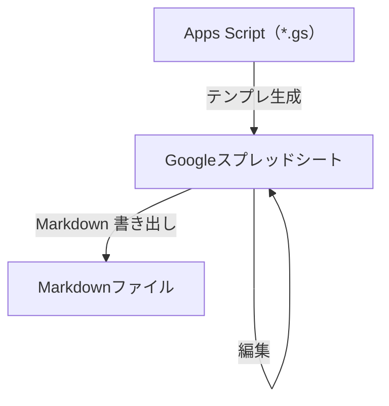

# 要求仕様書テンプレート（Google スプレッドシート）

本テンプレートは、**要求仕様**を**Google スプレッドシートで** 整理し、その内容を元にエンジニア向けにmarkdown形式の成果物を出力させる**ひな形**です。同梱の **Google Apps Script** で、タブ構成・採番・メニュー（行追加や Markdown 書き出しなど）が自動で展開されます。

## 作業の流れ

1. 初回 `createRequirementsSheet` でテンプレを展開する。
2. スプレッドシートで編集していく。
3. スプレッドシートの内容を元に、markdownを生成する。



## リポジトリ構成

Apps Script 側は役割ごとに 6 ファイルへ分割しています。同一プロジェクト内であればファイルをまたいで関数・var を共有できるため、ファイル間の import は不要です。

| ファイル | 役割 |
|----------|------|
| [`google-sheets-guide.md`](google-sheets-guide.md) | ブックの**編集・運用**、**ID**、**記述スタイル**、共有のコツなど。 |
| [`template-setup.gs`](template-setup.gs) | 定数、`createRequirementsSheet`（メイン展開処理）、共通UIヘルパー。**テンプレ全体の入口**。 |
| [`template-sheets.gs`](template-sheets.gs) | 各タブのヘッダー・列幅・初期サンプル行の定義（`setupXxx` 系）。 |
| [`validation.gs`](validation.gs) | ドロップダウン・別シート参照（BR／UC／アクターなど）の入力規則、ステータス条件付き書式。 |
| [`ids.gs`](ids.gs) | 🔢 ID管理 シートの読み書きと ID 採番ロジック。 |
| [`menu.gs`](menu.gs) | カスタムメニュー（`onOpen`）、行追加パネル、BUC／UC 詳細ブロックの追加。 |
| [`markdown-export.gs`](markdown-export.gs) | Markdown 書き出し（タブ走査・テーブル整形・エスケープ）。 |
| [`output/requirements-spec.md`](output/requirements-spec.md) | メニューから書き出した Markdown の**サンプル例**。 |

## 初回セットアップ（Google スプレッドシート）

1. 新しい [Google スプレッドシート](https://sheets.google.com/) を作成する。
2. **拡張機能** → **Apps Script** を開く。
3. エディタのデフォルトコードを削除し、[`template-setup.gs`](template-setup.gs) の内容を**すべて**貼り付けて保存する。
4. エディタ左側の「ファイル」の **＋** から新しいスクリプトファイルを追加し、残り5つの内容をそれぞれ貼り付けて保存する（ファイル名・追加順は自由）。
   - [`validation.gs`](validation.gs)
   - [`template-sheets.gs`](template-sheets.gs)
   - [`ids.gs`](ids.gs)
   - [`menu.gs`](menu.gs)
   - [`markdown-export.gs`](markdown-export.gs)
5. 関数 `createRequirementsSheet` を選び、**実行**する（初回は権限の承認が必要）。既存タブがあるブックでは上書き確認ダイアログが出る（詳細は下記「注意事項」）。
6. スプレッドシートに戻ると、ガイドに記載されたタブ（📋 概要、📌 前提条件、👤 アクター、🎯 ビジネス要求、📗 BUC、📙 BUC詳細、📖 UC一覧 など）ができる。**完了ダイアログ**に、メニュー「要求仕様書」を出すための再読み込み案内が含まれる。

ブック上での**編集・ID・記述・共有**の実務は [`google-sheets-guide.md`](google-sheets-guide.md) を参照してください。

## 注意事項

- `createRequirementsSheet` をテンプレのタブが既にあるブックで再実行すると確認ダイアログが出るが、**YESを選ぶと全シートが初期サンプルに戻る**（入力済みデータは失われる）。ダイアログが出ない・表示できない環境では安全側に倒して実行を中止する。
- **列やタブ構成を手で大きく変えると**、行追加・Markdown 書き出し・ID 同期などがスクリプトの前提とずれることがある。テンプレを変えたいときは該当する `.gs` ファイルを編集してください（どのファイルに何があるかは上の表を参照）。

## 開発者向け：テスト

`*.gs` のうち、ID採番・Markdown整形・BUC/UC詳細のパースなど Google Sheets API に依存しないロジックを Vitest でテストしています（`test/`）。`.gs` ファイル自体は変更せず、Node の `vm` モジュールでファイルをそのまま読み込み、`SpreadsheetApp` 等の呼び出し箇所だけ最小限のスタブ／モックシートに差し替えて検証します。

```bash
pnpm install
pnpm test        # 一括実行
pnpm test:watch  # 変更を監視して再実行
```

## ライセンス

[MIT](LICENSE)

