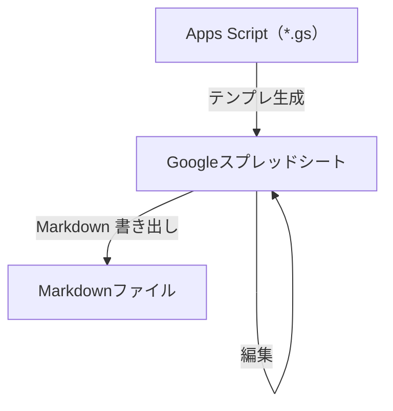

# 要求仕様書テンプレート（Google スプレッドシート）

本テンプレートは、**要求仕様**を**Google スプレッドシートで** 整理し、その内容を元にエンジニア向けにmarkdown形式の成果物を出力させる**ひな形**です。同梱の **Google Apps Script** で、タブ構成・採番・メニュー（行追加や Markdown 書き出しなど）が自動で展開されます。

## 作業の流れ

1. 初回 `createRequirementsSheet` でテンプレを展開する。
2. スプレッドシートで編集していく。
3. スプレッドシートの内容を元に、markdownを生成する。



## 前提条件

- [mise](https://mise.jdx.dev/)
- Google アカウントで [Apps Script API](https://script.google.com/home/usersettings) を有効化しておく

## 初回セットアップ（Google スプレッドシート）

### 1. コマンドを実行する

```bash
mise install
pnpm install
pnpm exec clasp login       # ブラウザでGoogleアカウント認証

# 新規に作る場合
pnpm exec clasp create-script --type sheets --title "要求仕様書テンプレート" --rootDir .

# 既存のスプレッドシートに紐付ける場合
pnpm exec clasp clone-script <scriptId> --rootDir .

pnpm exec clasp push --force
```

### 2. スプレッドシート側で操作する

> [!WARNING]
> 既存タブがあるブックで再実行し確認ダイアログで**YESを選ぶと、入力済みデータは全て消えます**。

1. スプレッドシートを開き、**再読み込み**する（メニューに「要求仕様書」が追加される）
2. メニュー「要求仕様書」→ **🆕 テンプレートを構築** を実行する（初回は権限の承認が必要）
3. ガイドに記載されたタブ（📋 概要、📌 前提条件、👤 アクター、🎯 ビジネス要求、📗 BUC、📙 BUC詳細、📖 UC一覧 など）ができる
4. ブック上での編集（詳細は [`google-sheets-guide.md`](google-sheets-guide.md) を参照）

## 注意事項

- 列・タブ構成をスプレッドシート上で直接変えると、行追加やMarkdown書き出しが壊れる。変更は該当する`.gs`を編集して行う（下記「リポジトリ構成」参照）。

## 開発者向け

### リポジトリ構成

Apps Script 側は役割ごとに 6 ファイルへ分割しています。同一プロジェクト内であればファイルをまたいで関数・var を共有できるため、ファイル間の import は不要です。

| ファイル | 役割 |
|----------|------|
| [`google-sheets-guide.md`](google-sheets-guide.md) | ブックの**編集・運用**、**ID**、**記述スタイル**、共有のコツなど。 |
| [`template-setup.gs`](template-setup.gs) | 定数、`createRequirementsSheet`（メイン展開処理）、共通UIヘルパー。**テンプレ全体の入口**。 |
| [`template-sheets.gs`](template-sheets.gs) | 各タブのヘッダー・列幅・初期サンプル行の定義（`setupXxx` 系）。 |
| [`validation.gs`](validation.gs) | ドロップダウン・別シート参照（BR／UC／アクターなど）の入力規則、ステータス条件付き書式。 |
| [`ids.gs`](ids.gs) | 🔢 ID管理 シートの読み書きと ID 採番ロジック。 |
| [`menu.gs`](menu.gs) | カスタムメニュー（`onOpen`）、行追加パネル、BUC／UC 詳細ブロックの追加。 |
| [`markdown-export.gs`](markdown-export.gs) | Markdown 書き出し（タブ走査・テーブル整形・エスケープ）。 |
| [`output/requirements-spec.md`](output/requirements-spec.md) | メニューから書き出した Markdown の**サンプル例**。 |

### テスト

```bash
pnpm install
pnpm test        # 一括実行
pnpm test:watch  # 変更を監視して再実行
```

## ライセンス

[MIT](LICENSE)
