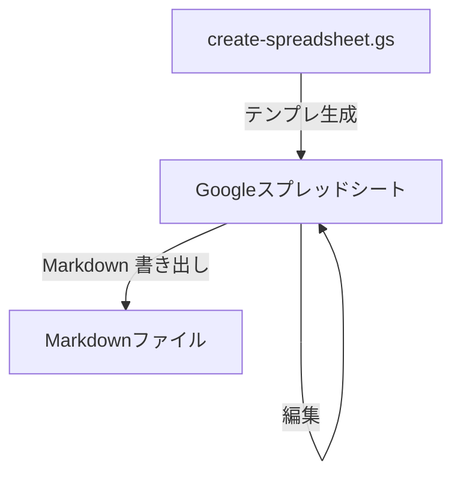

# 要求仕様書テンプレート（Google スプレッドシート）

本テンプレートは、**要求仕様**を**Google スプレッドシートで** 整理し、その内容を元にエンジニア向けにmarkdown形式の成果物を出力させる**ひな形**です。同梱の **Google Apps Script** で、タブ構成・採番・メニュー（行追加や Markdown 書き出しなど）が自動で展開されます。

## 作業の流れ

1. 初回 `createRequirementsSheet` でテンプレを展開する。
2. スプレッドシートで編集していく。
3. スプレッドシートの内容を元に、markdownを生成する。

## リポジトリ構成

| ファイル | 役割 |
|----------|------|
| [`google-sheets-guide.md`](google-sheets-guide.md) | ブックの**編集・運用**、**ID**、**記述スタイル**、共有のコツなど。 |
| [`create-spreadsheet.gs`](create-spreadsheet.gs) | シート一括生成、`createRequirementsSheet`、行追加パネル、Markdown 書き出し、ID 採番・再同期、メニュー登録。**テンプレ変更はこのファイル**。 |
| [`appsscript.json`](appsscript.json) | **`Sheets`**（v4）は、過去バージョンで付いた **テーブル（tbl_*）を削除する**ために使う（[`deleteExistingReqSpecTables_`](create-spreadsheet.gs)）。コンテナ側で無効でもテンプレは動くが、その場合は tbl が残ったブックを手動でテーブル解除する必要があることがある。 |
| [`output/requirements-spec.md`](output/requirements-spec.md) | メニューから書き出した Markdown の**サンプル例**。 |

## 初回セットアップ（Google スプレッドシート）

1. 新しい [Google スプレッドシート](https://sheets.google.com/) を作成する。
2. **拡張機能** → **Apps Script** を開く。
3. エディタのデフォルトコードを削除し、[create-spreadsheet.gs](create-spreadsheet.gs) の内容を**すべて**貼り付けて保存する。
4. **（推奨）** [`appsscript.json`](appsscript.json) に **Sheets Advanced サービス**を含める（リポジトリ同梱どおり）、または Apps Script で **サービスから Sheets（v4）を追加**する。`createRequirementsSheet` 実行時に **過去テンプレのテーブル（tbl_*）を API で取り除く**のに使う。ドロップダウン本体はすべて **標準の入力規則**（矢印）で統一されている。**Sheets が無効**でも動作するが、いったんテーブル化されたブックでは tbl の残骸が残る場合があるので、新規作成か手動でテーブルをオフにする。
5. 関数 `createRequirementsSheet` を選び、**実行**する（初回は権限の承認が必要）。**実行するたびに**各シートが初期サンプルで上書きされる（確認ダイアログなし）。入力を残したままにしたい場合は **`createRequirementsSheet` を再実行しない**こと。
6. スプレッドシートに戻ると、ガイドに記載されたタブ（📋 概要、📌 前提条件、👤 アクター、🎯 ビジネス要求、📗 BUC、📙 BUC詳細、📖 UC一覧 など）ができる。**完了ダイアログ**に、メニュー「要求仕様書」を出すための再読み込み案内が含まれる。

### `appsscript.json` の入れ方（ブラウザの Apps Script エディタ）

リポジトリの `[appsscript.json](appsscript.json)` をまだコピーしていない場合は、次のとおり追加する。

1. Apps Script エディタ左の **歯車（プロジェクトの設定）** を開く。
2. **「`appsscript.json` マニフェスト ファイルをエディタで表示する」** にチェックを入れる（英語 UI では *Show "appsscript.json" manifest file in editor*）。
3. 左のファイル一覧に `appsscript.json` が出るので、リポジトリの同名ファイルの内容を**すべて**貼り付けて保存する。
4. 既に **サービス** から Sheets を手動追加している場合も、マニフェストと重複して問題ありません（どちらか一方があれば Advanced サービスは利用可能）。

**clasp** を使う場合は、`create-spreadsheet.gs` とリポジトリ直下の `appsscript.json` をプロジェクトに同期する運用に合わせてください。

ブック上での**編集・ID・記述・共有**の実務は [`google-sheets-guide.md`](google-sheets-guide.md) を参照してください。

## 注意事項

- `createRequirementsSheet` をもう一度実行すると、確認なしで全シートが初期サンプルに戻る。すでに入力したブックがあるなら **再実行しない**（データが消える）。
- **列やタブ構成を手で大きく変えると**、行追加・Markdown 書き出し・ID 同期などがスクリプトの前提とずれることがある。テンプレを変えたいときは [`create-spreadsheet.gs`](create-spreadsheet.gs) を編集してください。

